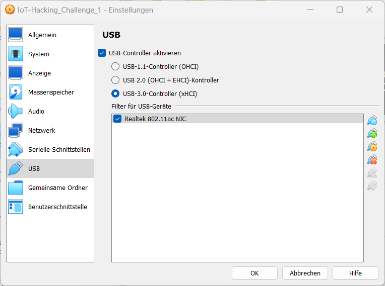
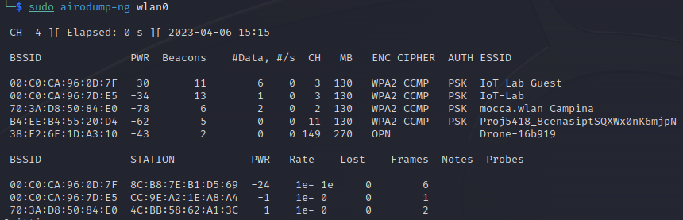
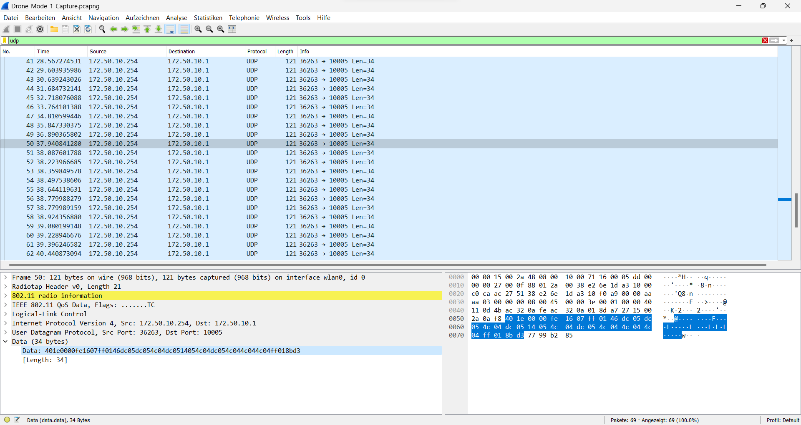

$$\Large{\color{red}Spoiler \space ahead!}$$

> __Warning__
Nachfolgend ist die Musterlösung der Challenge 1.
Nicht weiterlesen, wenn du diese Challenge noch absolvieren möchtest! Hinweise zum Lösen der Challenge findest du am Ende der Angabe.

<details>
<summary>Musterlösung anzeigen...</summary>
<br>

### Konfiguration der Entwicklungsumgebung

Als Entwicklungsumgebung wird eine Virtualbox Kali-VM verwendet.
In Virtualbox muss sichergestellt werden, dass der USB-3 Modus verwendet wird. Außerdem wird ein Filter für den WLAN-Adapter hinzugefügt, damit dieser automatisch mit der VM verbunden wird. Dazu steckt man bei abgeschalteter VM den Adapter an und kann diesen nun als Filter hinzufügen



### Installieren des WLAN-Adapters

Nach dem starten der VM wird ein apt update ausgeführt und der Treiber installiert:

```
sudo apt update
sudo apt install realtek-rtl88xxau-dkms
```

### WLAN-Netzwerk der Drohne finden

Um das WLAN-Netzwerk zu finden, das die Drohne ausstrahlt, wird in den verfügbaren Netzen einfach nach einer SSID gesucht, welche mit "Drone-" anfängt und versucht sich damit zu verbinden.


Dies gelingt und man erhält eine IP-Adresse über DHCP (172.50.10.x) und ein Standard-Gateway (172.50.10.1).

### Richtigen WLAN-Channel finden

Um den WLAN-Adapter später auf den richtigen Kanal einzustellen (dies dient der leichteren Aufnahme des Trafiics der Drohne, da andere Channel nicht gesnifft werden), muss dieser zuvor ermittelt werden. Mit dem Befehel `sudo airodump-ng wlan0` werden die verfügbaren Netze mit einigen Zusatzinformationen, inkl. des Kanals, angezeigt.



Man erkennt hier, dass der Kanal 149 verwendet wird.

### WLAN-Adapter konfigurieren

Um nun den WLAN-Traffic mitlesen zu können, muss man den WLAN-Adapter im Monitor Mode verwenden und auf den richtigen Kanal einstellen. Dies wird durch folgende Befehle erreicht:

```
sudo ip link set wlan0 down  
sudo airmon-ng check kill  
sudo iw wlan0 set monitor control  
sudo ip link set wlan0 up  
sudo iw dev wlan0 set channel 149
```

### WLAN-Traffic sniffen

Nun kann man in Wireshark das WLAN-Interface des WLAN-Adapters auswählen (wlan0) und sieht folgenden Traffic:



### Traffic interpretieren

Im Capture erkennt man unter allen Paketen 3 unterschiedliche Payloads: Keep-Alive Kommandos, Starten der Drohne und Stoppen der Drohne. Wenn man darauf achtet, wann welche Kommandos auftauchen, findet man heraus, dass die Payload `401e0000fe1607ff0146dc05dc054c04dc0514054c04dc054c044c044c04ff018bd3` das Lande-Kommando (Stoppen der Drohne) sein muss.

### Exploit entwickeln und durchführen

Mit dem Wissen, welche Payload zum Landen der Drohne gesendet werden muss, versucht man nun diese an die Drohne zu schicken. Dazu ist wichtig, dass die gesendeten Netzwerk-Pakete die gleiche Source-IP haben wie der Controller (172.50.10.254). Diese IP findet man im Capture, da die Pakete von 172.50.10.254 (Controller) an 172.50.10.1 (Drohne) geschickt werden.<br>
Um diese Pakete zu senden, kann ein einfaches Python-Script verwendet werden, welches die Bibliothek Scapy verwendet, um die Payload zu senden. Beispiel für ein funktionierendes Script:

[Exploit-Script](resources/exploit.py)

</details>
