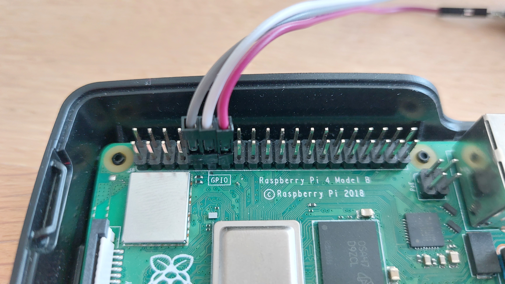
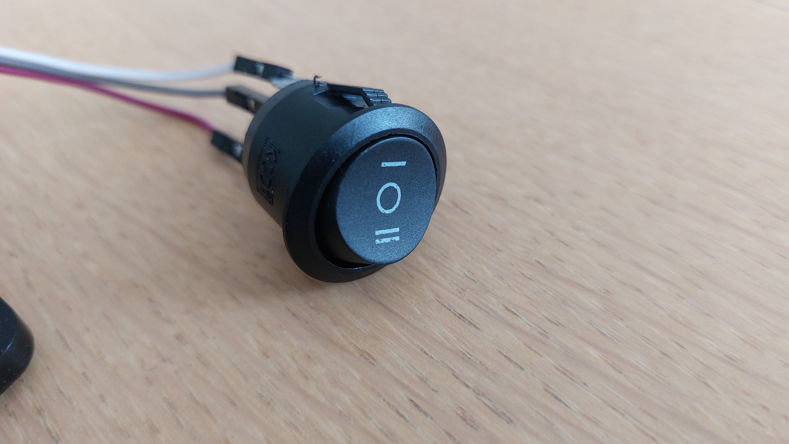
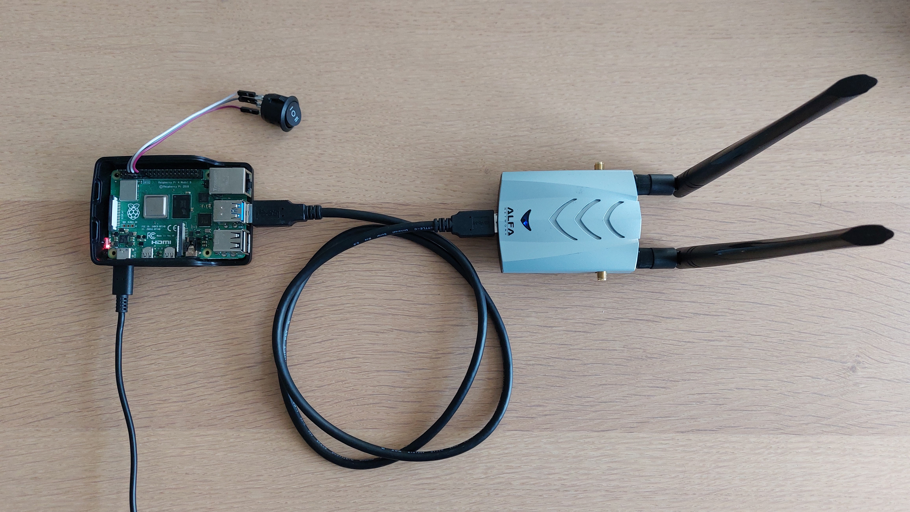
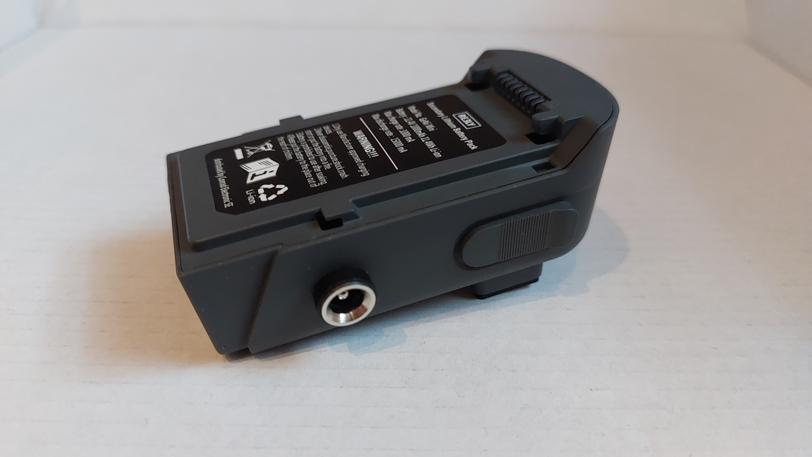
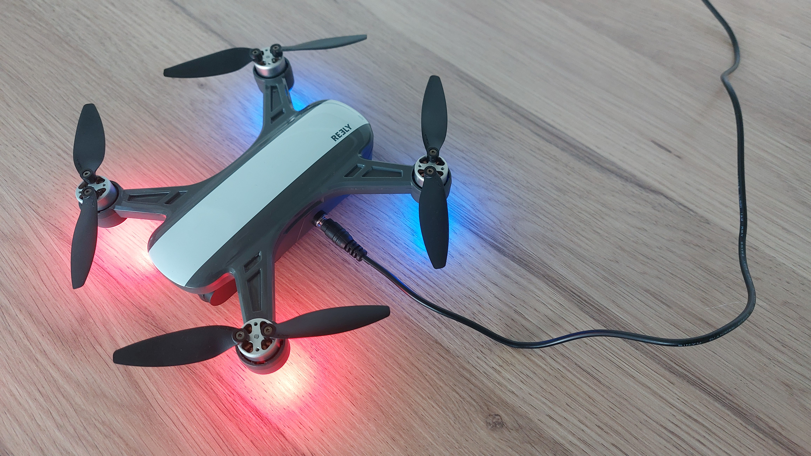
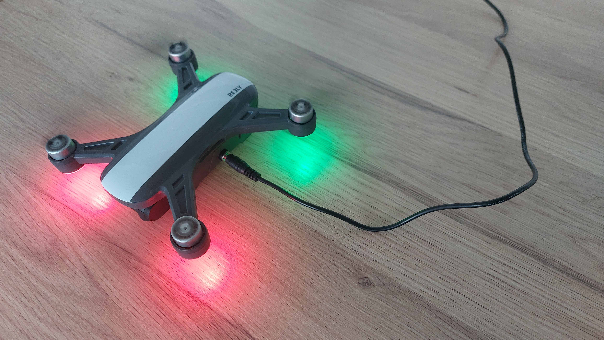

# Challenge 1 - Drone Hacking

## Thema

In dieser Challenge geht es darum die Kommunikation zwischen einer Drohne und deren Fernsteuerung zu hacken und so die Drohne zum Landen zu zwingen.

## Benötigte Ressourcen

- Reely Drohne + Power Adapter
- Raspberry Pi + Schalter + Netzteil
- 2x USB WLAN-Adapter (AWUS1900)
- Computer mit USB-Anschluss (Entwicklungsumgebung Kali empfohlen)

Der Challenge liegt ein USB-Stick mit einer Live-Verison von Kali 2023.1 bei.

## Die Ausgangslage

Du bist Besitzer eines Grundstückes und dir ist Privatsphäre sehr wichtig. Einer deiner Nachbarn besitzt eine Reely Drohne und du vertraust nicht darauf, dass er sich von deinem Grundstück fernhält. Aus diesem Grund willst du die Drohne hacken, um sie zum Landen zu zwingen, sobald sie die Grundstücksgrenze überfliegt. Du weißt, dass die Fernsteuerung mittels WLAN zur Drohne kommuniziert und dieses WLAN ungeschützt ist. Mit Hilfe eines WLAN-Adapters willst du nun die Kommunikation abfangen, um sie zu analysieren und anschließend zu modifizieren, um so die Drohne zu landen.

## Ziele

**Hauptziel:** Lande die Drohne (Rotoren hören sich auf zu drehen, während der Raspberry Pi im Modus 2 Flug-Kommandos schickt)

**Unterziele:**

1. Lies die Kommunikation zwischen der Drohne und dem Controller (Raspberry Pi) mit und finde das Landekommando. Um zu überprüfen, ob du das richtige Kommando abgefangen hast, kannst du Hinweis 4 nutzen (MD5 Hash des richtigen Kommandos).
2. Manipuliere diese Kommunikation und lass die Drohne landen.

**Nicht-Ziele**:

1. Es ist nicht Ziel den Raspberry Pi in irgendeiner Weise zu manipulieren.
2. Es ist nicht Ziel die Hardware der Drohne zu analysieren oder zu verändern, lediglich die drahtlose Kommunikation ist Ziel des Angriffs.
3. Es ist nicht Ziel die Drohne zu landen, in dem die Verbindung zwischen Drohne und Controller unterbrochen wird und die Drohne deswegen die Propeller abstellt. Während des Landevorgangs (Propeller abstellen) muss eine Controller-Verbindung bestehen (Drohne muss immer Grün leuchten).

## Vorbereitung/Allgemeines

Der Raspberry Pi ersetzt in diesem Setup die Fernsteuerung der Drohne. Er simuliert die Steuerung der Drohne, in dem er in regelmäßigen Abständen Flug-Kommandos an diese schickt. Für das Lösen der Challenge kannst du einen der zwei WLAN-Adapter verwenden (Der zweite wird an den Raspberry Pi angeschlossen, siehe Aufbau-Anleitung). Der Raspberry Pi hat 3 Modi, welche mit dem angeschlossenen Schalter ausgewählt werden.

### Die 3 Modi

**Modus 1 (Schalterstellung I):** Simulierter Start der Drohne<br>
Im Modus 1 schickt der Raspberry Pi Flug-Kommandos an die Drohne so, dass sich die Propeller alle 3 Minuten für ca 10 Sekunden drehen. Dieser Modus dient dazu die Kommunikation zu analysieren. Anhand dieser Kommunikation soll der Exploit entwickelt werden. In diesem Modus werden sowohl Start- als auch Lande-Kommandos gesendet, die abgefangen werden können. (Möchtest du eine größere Herausforderung bei der Challenge haben, starte im Modus 2)

**Modus 2 (Schalterstellung II):** Simulierter Dauer-Flug der Drohne<br>
Im Modus 2 schickt der Raspberry Pi Flug-Kommandos an die Drohne so, dass sich die Propeller dauerhaft drehen. Dieser Modus dient zum Durchführen des Exploits, bei dem die “fliegende” Drohne gelandet werden soll. Wechsle in diesen Modus, sobald du die Kommunikation erfolgreich analysiert hast und bereit bist die fliegende Drohne mit deinem Exploit zum Landen zu bringen.

**Modus 0 (Schalterstellung O):** Standby<br>
Im Modus 0 schickt der Raspberry Pi keine Kommandos an die Drohne, bleibt allerdings mit dem WLAN der Drohne verbunden. Da die Drohne keine Kommandos erhält, signalisiert sie, dass kein Controller verbunden ist, indem die LEDs der Drohne Blau und Rot leuchten. Sollten sich die Propeller zuvor drehen (z.B. durch den Modus 2), werden diese gestoppt. Nach mehreren Minuten in diesem Modus schaltet sich die Drohne automatisch ab. In diesem Fall muss nach Wiedereinschalten der Drohne auch der Raspberry Pi neu gestartet werden.<br>
Dieser Modus ist für das Lösen der Challenge irrelevant und dient lediglich dazu, dass temporär kein Traffic erzeugt wird. Dieser Modus kann Beispielsweise auch genutzt werden, um vom Modus 2 eine kurze Pause einzulegen, wenn man die Propeller kurz stoppen möchte.

Du kannst jederzeit zwischen den Modi wechseln, in dem du den Schalter in die gewünschte Position bringst.

### Aufbauen der Challenge

1. Überprüfe, ob an den Raspberry Pi der Schalter wie in folgendem Bil angeschlossen ist.  
    
2. Stelle den Modus-Schalter auf die Stellung Modus 1.  
    
3. Verbinde einen der zwei WLAN-Adapter (AWUS 1900) per USB (egal welcher Port) mit dem Raspberry Pi.
4. Das Setup sollte nun in etwa so aussehen:  
    
5. Stelle die Drohne so auf, dass die Propeller nicht blockiert werden.
6. Verwende statt einem Akku, den modifizierten Strom-Adapter (Schaut aus wie ein Akku, hat aber einen 12V Anschluss):  
    
7. Schließe nun die Drohne an das Stromnetz an und schalte sie ein, indem du einmal kurz und dann lange den Knopf auf dem Akku gedrückt hältst. Beim Starten der Drohne ertönt ein lautes Piepen. Ist die Drohne gestartet, leuchtet sie Blau und Rot.  
    
8. Schließe nun den Raspberry Pi an das Stromnetz an, dieser startet dann automatisch. Nach etwa 35 Sekunden sollte die Drohne nun in Grün und Rot leuchten und die Propeller starten. Dies bedeutet, dass die Verbindung erfolgreich war. Der Raspberry Pi schickt nun regelmäßig Flug-Kommandos and die Drohne im gewählten Modus.  
    
9. Die Vorbereitung ist nun abgeschlossen, beginne mit dem Lösen der Challenge.

------------------------------------------------------------------------

# Hinweise

Hier findest du Hinweise, falls du beim Lösen der Challenge nicht weiterkommst.

## Hinweis 1

Öffne diesen Hinweis, wenn du nicht weißt, wie du beginnen sollst.

<details>
<summary>Hinweis 1 anzeigen…</summary>
<br>
Versuche die Kommunikation mit Hilfe des WLAN-Adapters und Wireshark aufzuzeichnen. Empfohlen wird hierzu eine VM mit Kali-Linux. Du musst nicht zwingend den WLAN-Adapter verwenden, allerdings benötigst du ein WLAN-Gerät, dass den Monitor-Mode unterstützt. Nur im Monitor-Mode kannst du die Kommunikation aufzeichnen.
</details>

## Hinweis 2

Öffne diesen Hinweis, wenn dir die Aufzeichnung der Kommunikation zwischen Drohne und Controller nicht gelingt bzw. du den Traffic nicht siehst.

<details>
<summary>Hinweis 2 anzeigen…</summary>
<br>
Möglicherweise ist der WLAN-Adapter nicht richtig installiert.
Hier ist eine Anleitung dazu, wie man den WLAN-Adapter in einer Virtualbox Kali-VM richtig installiert und im Monitor-Modus verwendet:

1. Schließe den WLAN-Adapter an
2. Geh in die VM-Einstellungen und stelle sicher, dass der USB3 Modus verwendet wird.
3. Füge einen Filter hinzu, um den Adapter automatisch zu verbinden.
4. Starte die VM und führe folgende Befehle aus:
```
sudo apt install realtek-rtl88xxau-dkms  
sudo sh -c "echo '1' > /sys/module/8814au/parameters/rtw_switch_usb_mode"
sudo ip link set wlan0 down  
sudo airmon-ng check kill  
sudo iw wlan0 set monitor control  
sudo ip link set wlan0 up  
sudo iw dev wlan0 set channel 149
```
    Mit diesen Befehlen werden:
    - Die Treiber des Adapters installiert
    - Der Adapter im USB3 Modus gestartet
    - Das Interface gestoppt, auf monitor mode gestellt und wieder gestartet
    - Das Interface auf Channel 149 konfiguriert
5. Starte nun Wireshark. Du solltest nun die Kommunikation mitlesen können.

Sollte dir das Aufzeichnen nicht gelingen, ist hier ein Capture-File, in welchem die Kommunikation zwischen Drohne und Controller im Modus 1 zu finden ist: [Capture](Angabe-resources/Drone_Mode_1_Capture.pcapng)
</details>

## Hinweis 3

Öffne diesen Hinweis, wenn du nicht weißt, was du mit der aufgezeichneten Kommunikation anstellen sollst.

<details>
<summary>Hinweis 3 anzeigen…</summary>
<br>
In der aufgezeichneten Kommunikation befinden sich Kommandos zum Landen der Drohne (UDP Pakete). Finde heraus, welche das sind und versuche diese anschließend an die Drohne zu schicken (Replay Attacke). Sieh dir dazu die Payloads der aufgezeichneten Pakete an und vergleiche sie.
<br><br>  
Wenn dir die Aufzeichnung nicht selbst gelungen ist und du das bereitgestellte Capture verwendest, versuche anhand der Zeitstempel und dem Verhalten der Drohne zu eruieren was welche Kommandos bedeuten könnten.
</details>

## Hinweis 4

Öffne diesen Hinweis, wenn du dir nicht sicher bist, ob du das richtige Kommando aus der Kommunikation extrahiert hast.

<details>
<summary>Hinweis 4 anzeigen…</summary>
<br>
Hier ist der MD5-Hash der Payload(Hex-Stream) des Pakets mit dem Landekommando: 
    
```
f92c04b4a1050fa4856296c78f8a1a97
```   
</details>

## Hinweis 5

Öffne diesen Hinweis, wenn du nicht weißt, wie du den Angriff entwickeln sollst.

<details>
<summary>Hinweis 5 anzeigen…</summary>
<br>
Wenn du das korrekte Kommando aus der Kommunikation extrahiert hast, musst du einen Weg finden dieses an die Drohne zu schicken. Die Drohne akzeptiert nur Kommandos vom Controller. Finde heraus, welche IP-Adresse der Controller hat und schicke das Stop-Kommando mit dieser IP-Adresse. 

Tool-Empfehlung: Scapy
</details>

## Hinweis 6

Öffne diesen Hinweis, wenn du Probleme dabei hast, den Angriff durchzuführen.

<details>
<summary>Hinweis 6 anzeigen…</summary>
<br>
Verbinde dich mit dem offenen WLAN der Drohne. Starte nun deinen Exploit, in welchem du mit einer gefälschten IP-Adresse (die des Controllers) das Lande-Kommando mindestens 10 mal pro Sekunde an die Drohne schickst.
<br><br>
Hier ist ein Python-Script, welches diesen Exploit implementiert: 

[Exploit-Script](Musterlösung/resources/exploit.py)
</details>
