$$\Large{\color{red}Spoiler \space ahead!}$$

> __Warning__
Nachfolgend ist die Musterlösung der Challenge 2.
Nicht weiterlesen, wenn du diese Challenge noch absolvieren möchtest! Hinweise zum Lösen der Challenge findest du am Ende der Angabe.

Musterlösung anzeigen...

 

### Zerlegen des Routers

Da es Ziel ist auf die UART-Schnittstelle des Netgear Routers zuzugreifen, muss dieser geöffnet werden. Dazu entfernt man zuerst auf der Unterseite alle 5 Schrauben (Dies sollte im SESAM bereits erledigt sein). 
Nun kann man den Deckel abnehmen und legt die Platine des Routers frei. Diese kann im restlichen Gehäuse gelassen werden und muss nicht ganz herausgenommen werden.

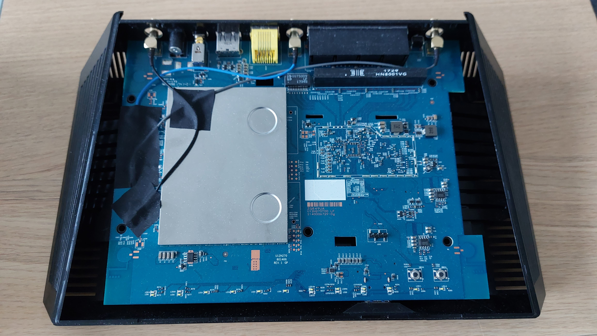

### Finden der UART-Schnittstelle

Um die UART-Schnittstelle zu finden, wird ein Logic Analyzer von SALEA verwendet. 
Bei den meisten Geräten ist die UART-Schnittstelle auf Debugging-Pins wie hier zu finden. Leider sind sie oft nicht beschriftet oder versteckt.

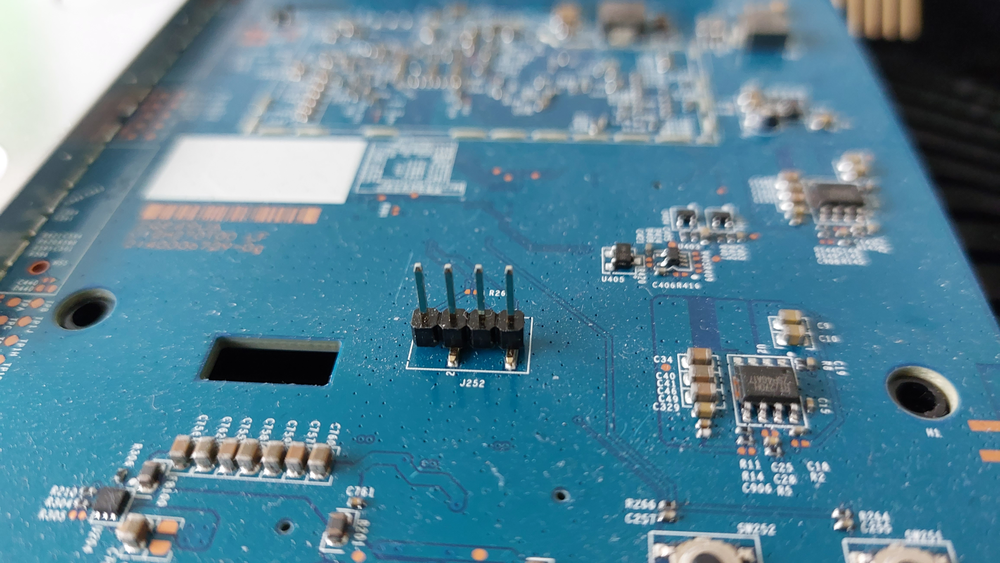

Um die UART-Pins richtig zuzuordnen, verbindet man die 4 Pins mit dem Logic Analyzer und sucht nach Daten, die übertragen werden. Nicht vergessen sollte man hier eine zusätzliche Verbindung zur Masse des Routers. Im Fall dieses Routers werden Bootloader- und Kernel-Protokolle beim Start auf diese Schnittstelle ausgegeben, so dass man diese mitlesen kann, sobald man die richtigen Pins gefunden hat.

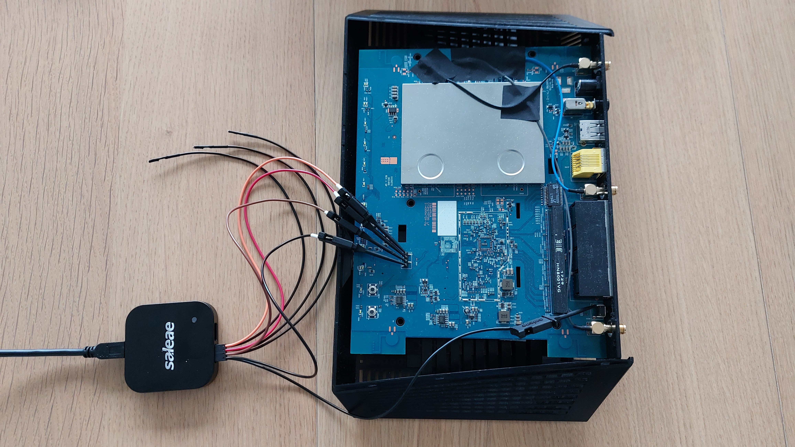

In der Software des Logic Analyzers stellt man die digitalen Channel 0-4 ein und deaktiviert alle analogen Channel. Eine Abtastrate von mindestens 8MS/s sollte gewählt werden.

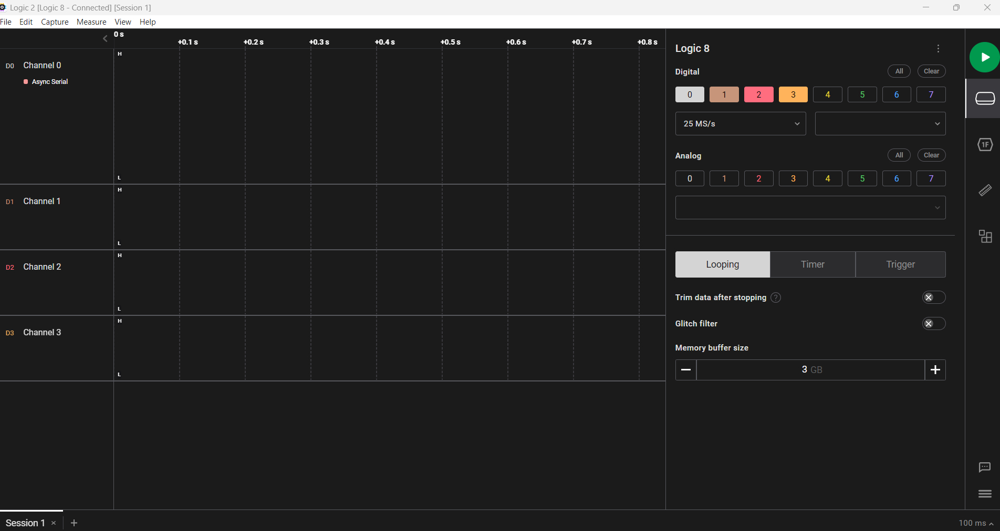

Startet man nun die Aufnahme und schaltet den Router ein, so sieht man bei 2 Channel eine Veränderung. Channel 3 ist stetig auf High, was bedeutet hier liegen einfach nur 3,3V an. An Channel 1 sieht man viele Sprünge von 0 auf 3,3V und zurück, was auf übertragene Daten hinweist.

Nun wählt man aus der Liste der Analyzer den Async Serial aus, ein Analyzer, der simplen Seriellen Traffic lesen kann. Als Input-Channel wählt man hier den Channel mit den potentiellen Daten, in diesem Beispiel Channel 1. Alle anderen Parameter lässt man fürs erste auf den Standard-Einstellungen, da diese die meist verbreitetsten sind und die Wahrscheinlich mit diesen ein Ergebnis zu erzielen sehr hoch ist.

Schaut man sich nun den Konsolen-Output des Analyzers an, erkennt man bereits lesbaren Text. Dies ist Ausgabe-Text des Routers beim booten, was bedeutet die UART-Schnittstelle wurde gefunden.

Channel 0 und 2 sind Ground und der Pin für Daten Input, also Konsolen Befehle. Prüft man mit einem Multimeter nun die Pins gegen Masse, erkennt man, dass Channel 2 ebenfalls Masse ist. Dies bedeutet die Pins sind von Links nach rechts:

| Pin1 | Pin2| Pin3| Pin4|
|---|---|---|---|
| 3.3V | GND | TX | RX |

### Herstellen der Verbindung

Um nun eine Verbindung zwischen Computer und Konsole des Routers herzustellen, wird ein USB zu TTL Adapter verwendet. 
Man verbindet GND mit GND, RX des Adapters mit TX des Routers, und TX des Adapters mit RX des Routers. Der Adapter wird dann über USB mit dem Computer verbunden.
  
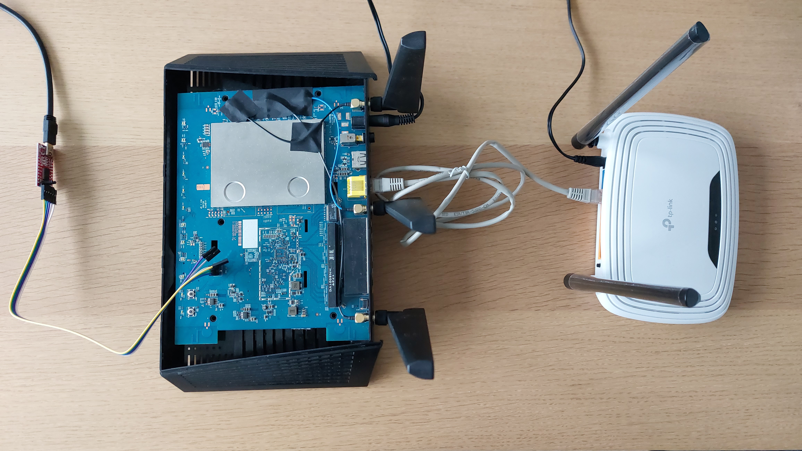
  
Man verwendet nun ein geeignetes Programm, um mit dem Adapter zu kommunizieren. In diesem Beispiel wird MobaXTerm verwendet, aber ein Programm wie Putty od. Ä. funktioniert ebenso.

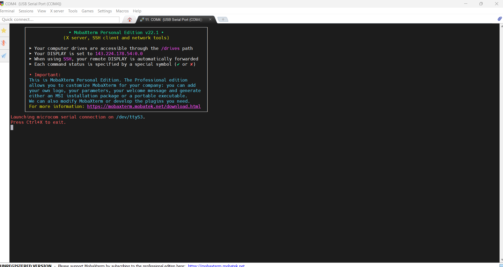

Schaltet man nun den Router ein, kann man am Computer erneut des Output sehen, den man bereits mit dem Logic-Analyzer bekommen hat.

Drückt man nun "Enter" bekommt man die Information, dass als Shell Busybox verwendet wird. Man kann nun Befehle an den Router schicken.

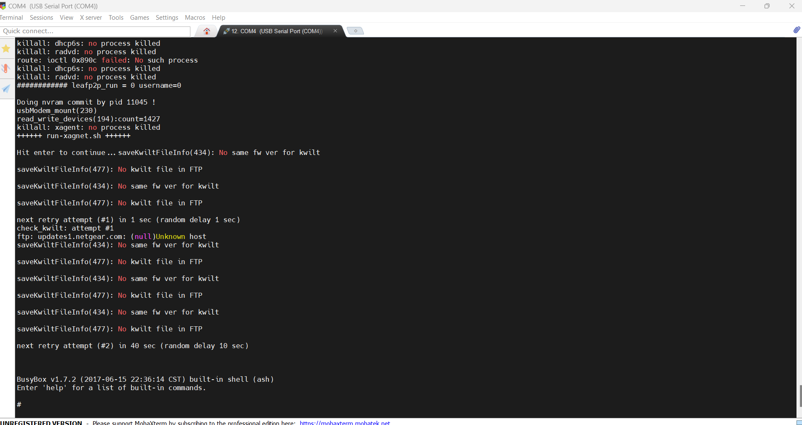

### Der Exploit

Der Fernzugriff auf den Router kann über die Web-Oberfläche aktiviert werden. Dazu muss man im Netzwerk des Routers sein und das Administrator-Passwort kennen. Um in das Netzwerk des Routers zu kommen, kann man sich einfach mit einem Netzwerkkabel am Router anschließen. Da man ungeschützten Root-Zugriff auf die Konsole des Routers hat, versucht man so das Admin-Passwort ausfindig zu machen. Das vom Router verwendete Linux bietet viele Linux-Funktionen, unter anderem auch den Befehl nvram. Mit diesem Befehl kann man sich die Parameter des vom Router verwendeten NVRAM ansehen. In diesem sind auch alle Zugangsdaten gespeichert. Da es im NVRAM sehr viele Einträge gibt, sucht man mit grep nach Strings die "pass" enthalten, also Einträge, die ein Passwort enthalten. Man sieht nun einige Passwort-Einträge. Beim durchsuchen findet man das http-password, also das gesuchte Administrator-Passwort. Außerdem findet man auch die wla_passphrase, welche das Passwort für das WLAN ist.

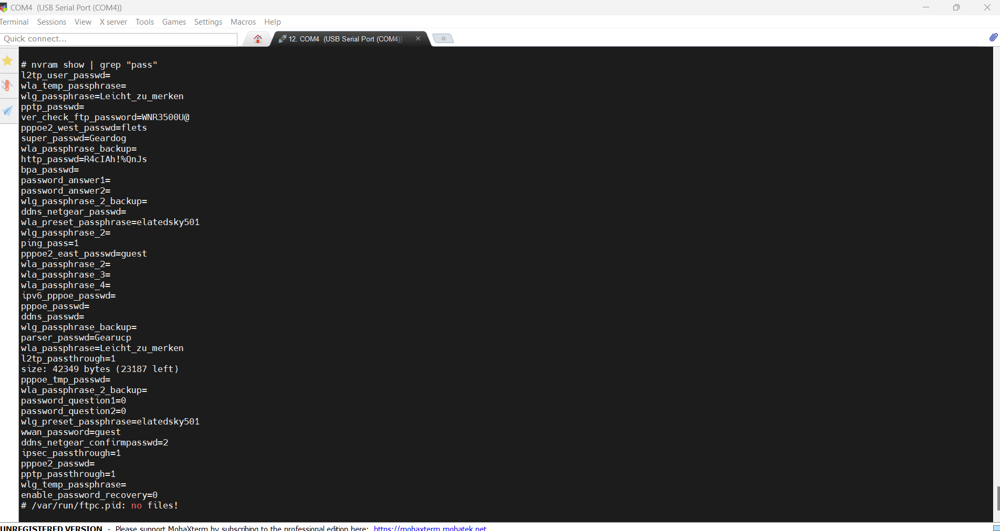

Mit Hilfe des WLAN-Passwortes kann man sich nun mit dem WLAN des Routers verbinden, anstatt ein Kabel verwenden zu müssen

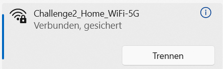

Ruft man nun die IP-Adresse des Routers auf (Standardgateway) wird man nach den Zugangsdaten gefragt.

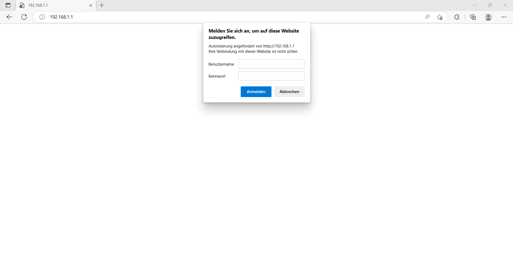

Gibt man nun das in der Konsole gefundene Passwort für den Benutzer admin ein, kommt man zur Konfiguration des Routers.

Unter dem Reiter "Erweitert" findet man einige Informationen des Routers, wie dessen IP-Adresse im "Internet" also dem Netzwerk des TP-Link Routers. Dies ist die Adresse, unter der der Fernzugriff eingerichtet wird.

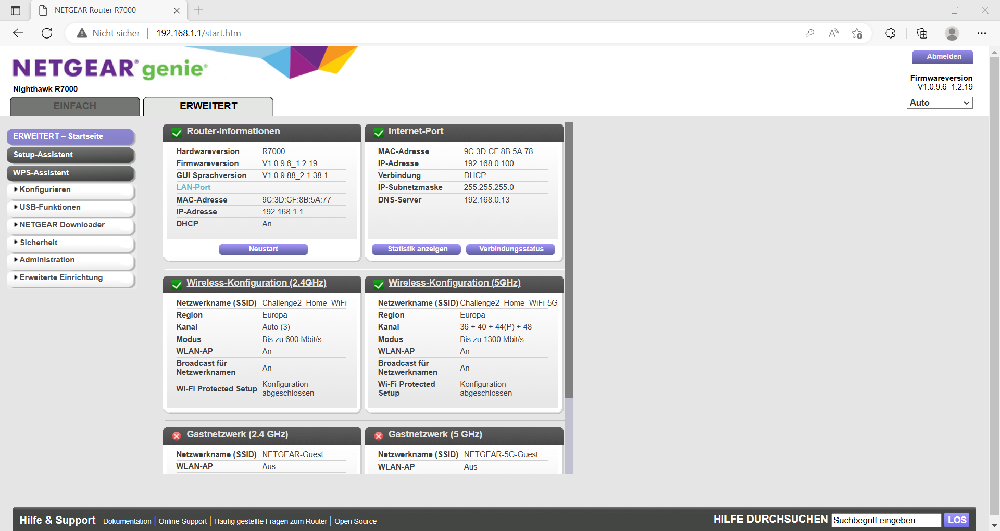

Unter "Erweiterte Einrichtung" -> "Fernsteuerung" aktiviert man nun den Fernzugriff. Hier auch auch die IP-Adresse und der Port für den Zugriff angezeigt.

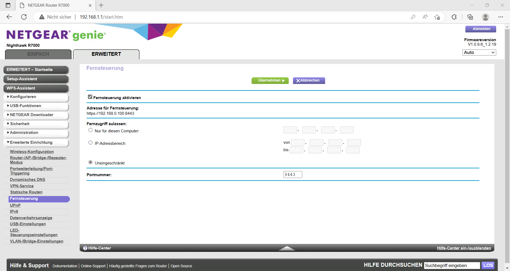

Nun verbindet man sich mit dem "Internet", aus welchem der gehackte Router nun erreichbar sein sollte.

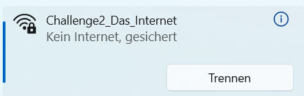

Ruft man nun die zuvor abgelesene Adresse und Port auf, erscheint die Anmeldefläche. Dies bedeutet, der Router ist nun aus dem "Internet" erreichbar.

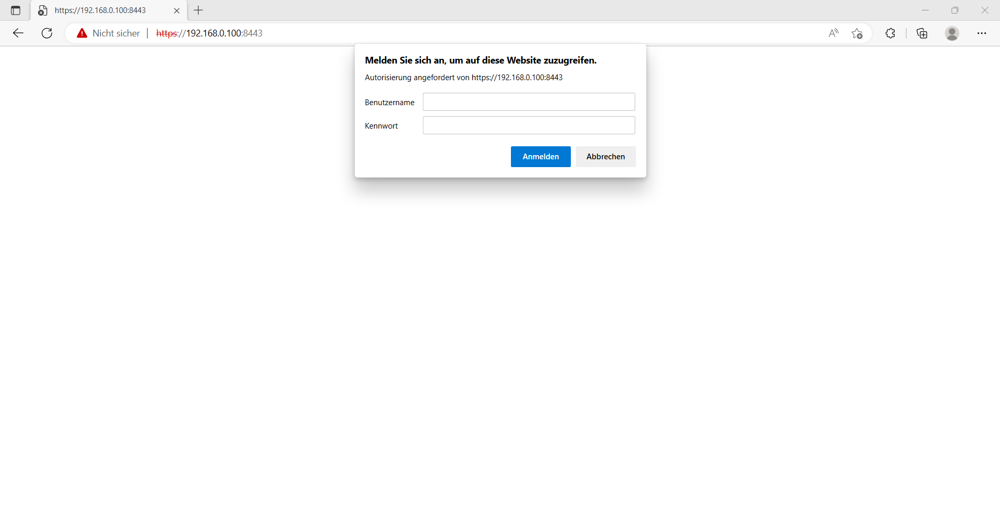

Man meldet erneut mit den Administrator-Zugangsdaten an und hat somit die Challenge gelöst.

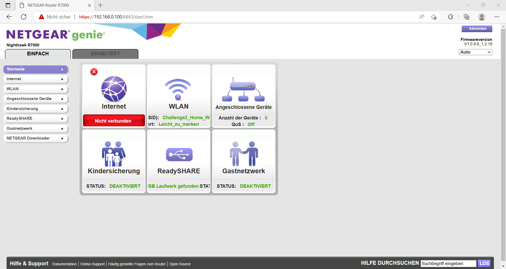

