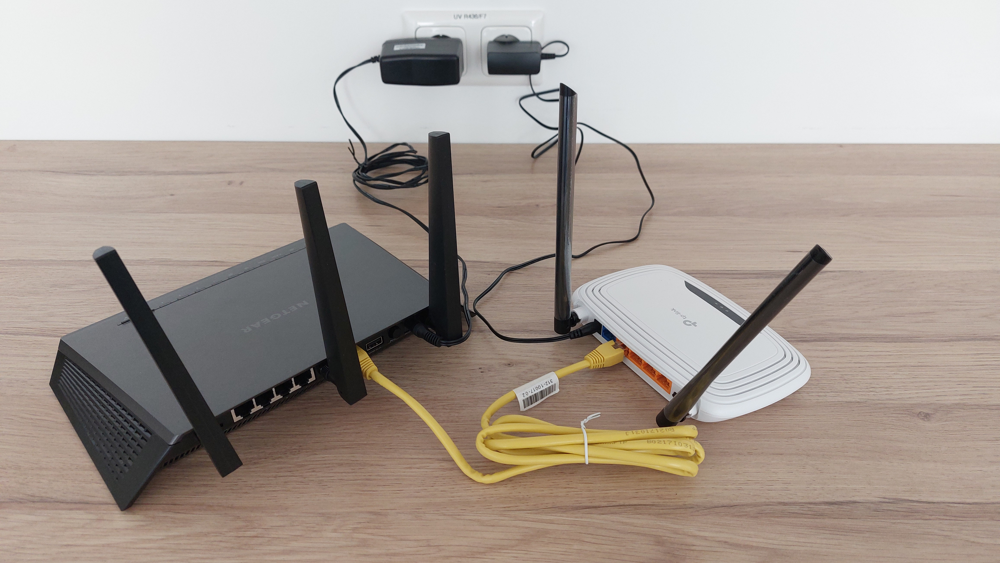
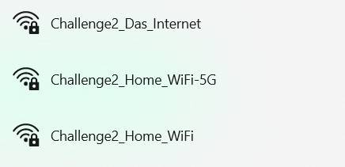
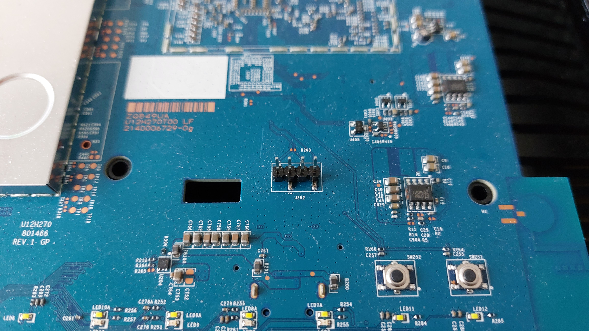
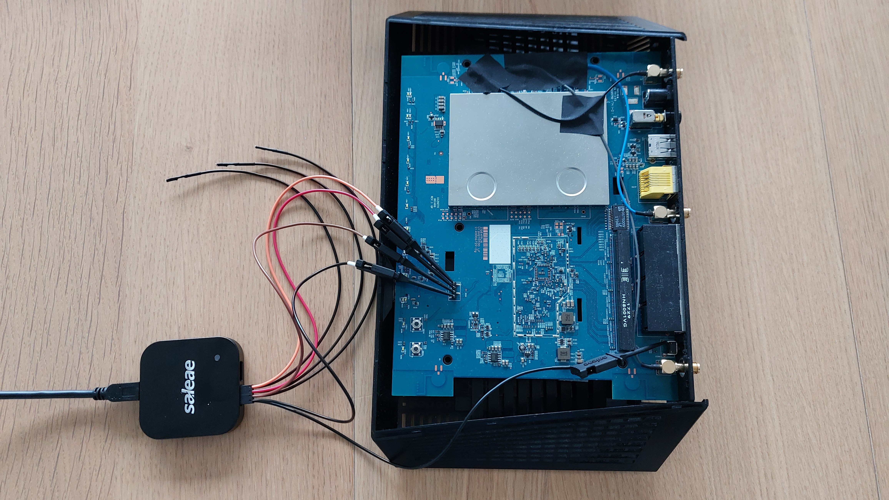
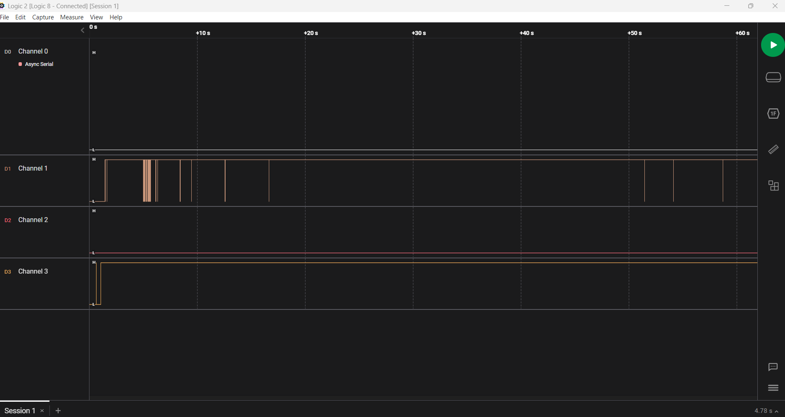
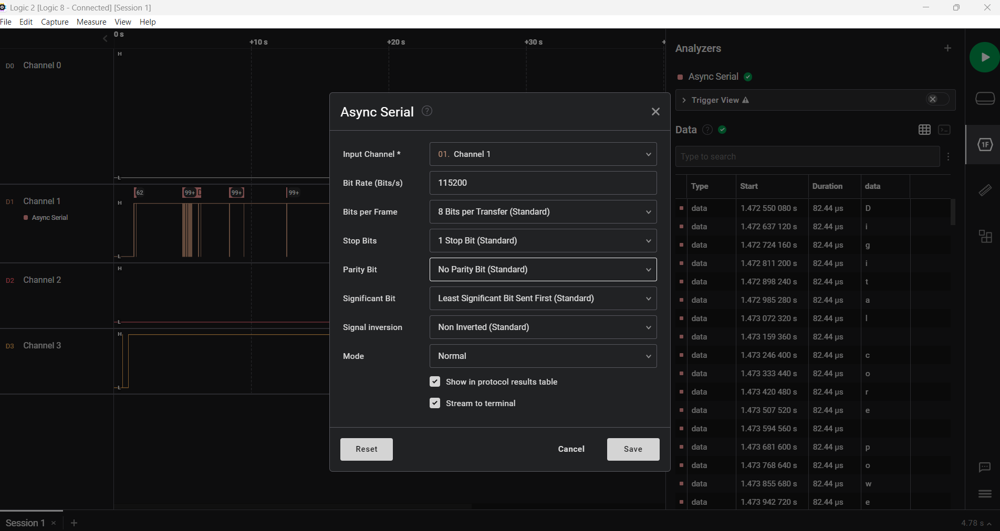
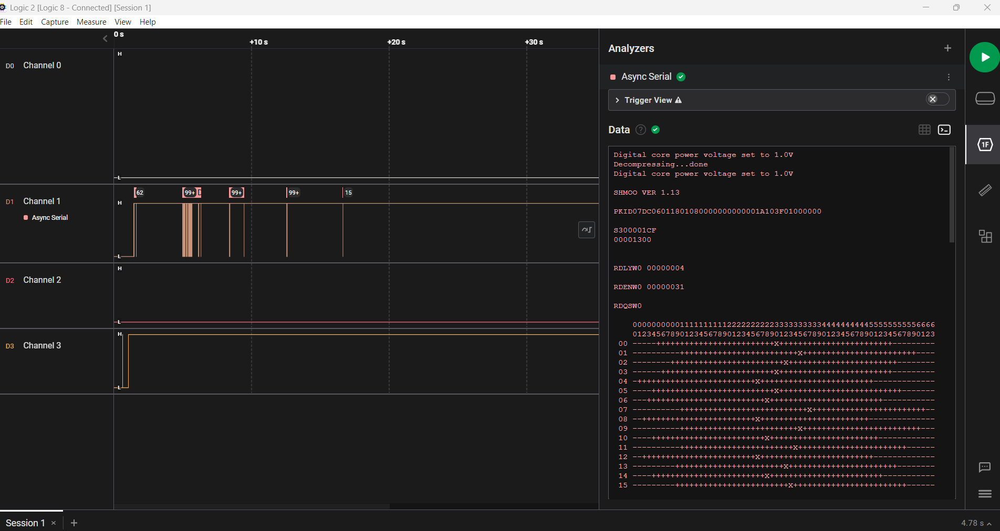
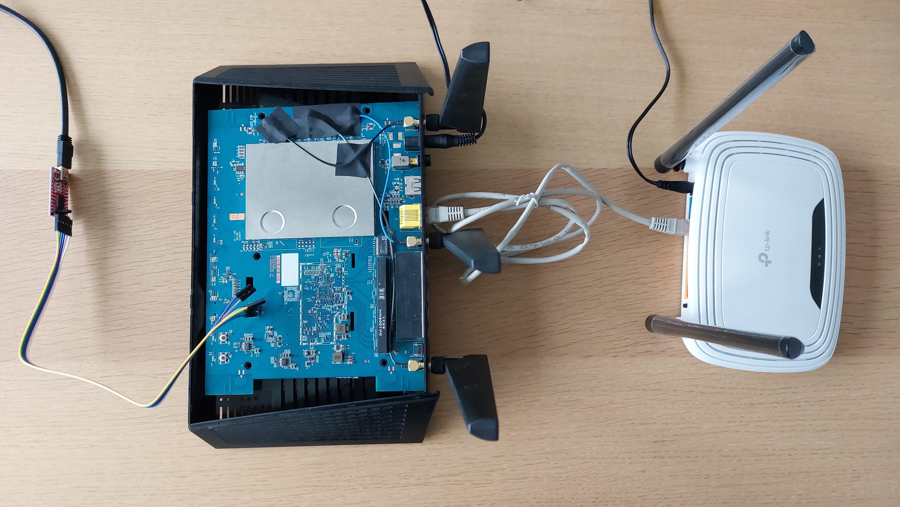
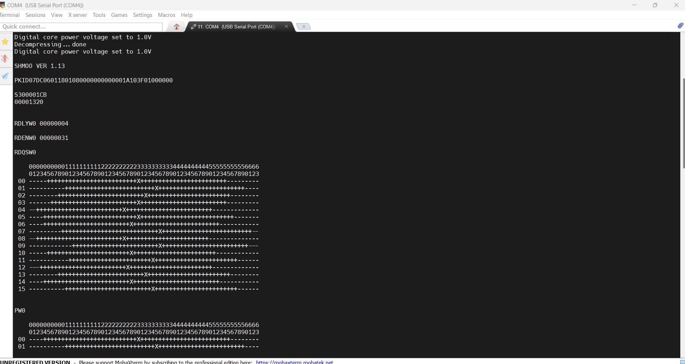

# Challenge 2 - Hardware Hacking

## Thema

In dieser Challenge geht es darum den Fernzugriff auf einem Router durch Ausnutzen einer ungeschützten Hardware-Schnittstelle zu aktivieren.

## Benötigte Ressourcen

* TP-Link WR841N WLAN-Router + Netzteil
* Netgear R7000 WLAN-Router + Netzteil
* 1x Lan-Kabel
* Logic Analyzer (Logic 8)
* USB zu TTL Adapter + USB-Kabel
* Computer mit USB-Anschluss

## Die Ausgangslage

In dieser Challenge ist der Netgear R7000 WLAN-Router ein Router, der in einem Haushalt verwendet wird.
Du bist ein Angreifer, der versucht dauerhaft von außen, also aus dem Internet (In der Challenge das simulierte Internet "Challenge2_Das_Internet") Zugriff auf den Router zu erlangen.
Durch geschicktes Einfädeln einer Ablenkung stehst du nun im Haus des Opfers vor dem Router. Du hast 2 Stunden Zeit, bis der Besitzer zurückkommt. In dieser Zeit versuchst du Zugriff auf den Router zu erlangen, um den Fernzugriff einzurichten. Dabei darf der Router nur so minimal verändert werden (Hardware & Software), sodass der Eigentümer des Routers nicht bemerkt, dass etwas anders ist. Das bedeutet der Router darf zum Beispiel nicht einfach zurückgesetzt werden, oder das Passwort des WLANs geändert werden. Du hast einen Laptop, einen Logic Analyzer und einen USB zu TTL Adapter dabei. Deine Idee ist es, den Router aufzumachen, mit Hilfe des Logic Analyzers die UART-Schnittstelle zu ermitteln und anschließend über den PC mittels des Adapters auf die Konsole des Routers zuzugreifen.

## Ziele

**Hauptziel:** Ziel dieser Challenge ist es, über das "Internet" Zugriff auf die Weboberfläche des R7000 zu erlangen ohne dass Veränderungen am Router für einen Laien (durchschnittlicher Benutzer eines Heim-Routers) erkennbar sind. 
Konkret: Du hast die Challenge gelöst, wenn du dich mit deinem Computer mit dem "Internet" verbindest und dann im Browser über die IP-Adresse des Netgear Routers dessen Web-Oberfläche erreichst und dich auf dieser anmelden kannst.

**Unterziele:**

1. Finde mit Hilfe des Logic Analyzer die UART-Schnittstelle.

    Durch benutzen von Google lässt sich schnell herausfinden, welche Pins der UART-Schnittstelle am Router welche Bedeutung haben. Die Challenge hat allerdings unter anderem zum Ziel, dass man die richtige Verwendung eines Logic Analyzers erlernt. Durch einfaches Googeln der Lösung beraubt man sich dieser Lernerfahrung. Ziel ist es wirklich nur mit Hilfe des Logic Analyzers die Bedeutung der einzelnen Pins herauszufinden. 
2. Greife auf die Shell des Routers zu und finde einen Weg den Fernzugriff zu aktivieren. 
3. Erreiche die Web-Oberfläche des Netgear Routers über das "Internet".

**Nicht-Ziele**:

1. Es ist nicht Ziel den TP-Link Router zu hacken oder zu verändern. 
2. Es ist nicht Ziel das WLAN- oder Administrator-Passwort des Netgear Routers zu verändern.

## Vorbereitung/Allgemeines

Bevor du diese Challenge beginnst, sprich mit Markus Zeilinger oder Dieter Vymazal, da einer der beiden den Netgear R7000 WLAN-Router für die Challenge vorbereiten muss.

Der kleine weiße TP-Link WR841N WLAN-Router simuliert das Internet, das bedeutet, dass dessen Netzwerk als das "Internet" in dieser Challenge betrachtet wird, um die Challenge in einer simulierten Umgebung durchzuführen. Er strahlt das WLAN "Challenge2_Das_Internet" aus. Das Passwort für das WLAN ist "World_Wide_SESAM". Die Konfiguration dieses Routers darf nicht verändert werden bzw. soll dieser Router nicht gehackt werden. Er dient lediglich dazu das Internet zu simulieren.

Der Netgear Router muss zum Lösen der Challenge aufgemacht/aufgeschraubt werden. Die Schrauben sind bereits gelöst und entfernt, sodass sich die Obere Abdeckung des Routers einfach abnehmen lässt. Bitte nach Beenden der Challenge diese Abdeckung einfach nur wieder auf den Router setzen und nicht anschrauben.

### Aufbauen der Challenge

1. Verbinde den WAN-Port des Netgear R7000 WLAN-Router mit einem Kabel an einen LAN-Port des "Internet" (WR841N Router). So glaubt dieser, dass er mit dem echten Internet verbunden ist, da er hier eine IP-Adresse bekommt. Die IP-Adresse wird vom "Internet" über DHCP vergeben, das bedeutet, dass der R7000 nicht zwangsweise immer die gleiche IP-Adresse bekommt.
2. Verbinde nun beide Router mit dem Stromnetz und schalte den Netgear Router ein, der TP-Link Router startet sobald er Strom hat. Das Setup sollte nun in etwa so aussehen: 

    
3. Ist alles eingeschaltet und gestartet, solltest du folgende 3 WLAN-Netzwerke sehen:

    
5. Beginne nun die Challenge zu lösen.

------------------------------------------------------------------------

# Hinweise

Hier findest du Hinweise, falls du beim Lösen der Challenge nicht weiterkommst.

## Hinweis 1

Öffne diesen Hinweis, wenn du nicht genau weißt, wie du den Logic Analyzer richtig mit dem Router verbindest.

Hinweis 1 anzeigen…

 
Finde folgende 4 Pins am Mainboard des Routers: 
     
Verbinde 4 Kanäle des Logic Analyzer mit den 4 Pins. Verbinde außerdem einen Ground-Anschluss des Analyzer mit Ground des Routers. Verwende dazu einfach ein Metall-Gehäuse eines Anschlusses. 
    

## Hinweis 2

Öffne diesen Hinweis, wenn du nicht weißt, wie du die Aufzeichnung des Logic Analyzer richtig analysierst/interpretierst.

Hinweis 2 anzeigen…

 
Die Aufzeichnung sollte beim Booten des Rputers in etwa wie folgt aussehen: 
     
Wähle nun den Async Serial Analyzer und konfiguriere die richtigen Parameter. Dies sind Standard Parameter, versuche mehrere Standard-Parameter bis der Output sinnvollen Text ergibt. (Trial and Error). Hier findest du die richtigen Parameter: 
     
     
    
Dies bedeutet, dass dieser Pin TX des Routers ist.
    
Auf einem anderen Kanal siehst du ein Signal, dass durchgehend High ist. Dies scheint die Stromversorgung(VCC) zu sein.
    
Es bleiben zwei Kanäle übrig, die beide durchgehend auf Low sind. Einer davon ist Ground, der andere RX.
    Löse alle Verbindungen des Analyzers zum Router, außer TX. Verbinde nun Ground des Routers mit einem der zwei noch unbekannten Pins. Wenn du zu Ground verbunden bist, kannst du wieder Kommunikation lesen.

## Hinweis 3

Öffne diesen Hinweis, um zu überprüfen, ob du die Pins richtig analysiert hast.

Hinweis 3 anzeigen…

 
Die Pins sind von Links(Richtung große Metallfläche) nach Rechts:
    
| Pin1 | Pin2 | Pin3 | Pin4 |
| ---- | ---- | ---- | ---- |
| 3.3V | GND | TX | RX | 

## Hinweis 4

Öffne diesen Hinweis, wenn du nicht weißt, wie du den USB zu TTL Adapter richtig verwendest.

Hinweis 4 anzeigen…

 
Verbinde nun GND des Adapters mit GND des Routers.
Verbinde RX des Adapters mit TX des Routers.
Verbinde TX des Adapters mit RX des Routers. 
     
Verbinde den Adapter über USB mit deinem Computer. Verwende ein Programm wie Putty um dich mit dem Adapter zu verbinden. Konfiguriere die Schnittstelle zum Adapter mit den gleichen Parametern, die du beim Logic Analyzer für den Serial Analyzer verwendet hast. Du solltest nun den Output des Routers sehen. 
     
Durch Druck auf Enter startet BusyBox und du kannst Befehle an den Router schicken.

## Hinweis 5

Öffne diesen Hinweis, wenn du nicht weißt, wie du die Root-Shell verwendest, um Zugriff auf den Router zu bekommen.

Hinweis 5 anzeigen…

 
Mit dem Befehl nvram lassen sich gespeicherte Parameter im RAM des Routers anzeigen. Suche hier nach Passphrasen.

## Hinweis 6

Öffne diesen Hinweis, wenn du nicht weißt, wie du den Fernzugriff aktivierst.

Hinweis 6 anzeigen…

 
Verbinde dich zur Weboberfläche des Routers. Unter "Erweiterte Einrichtung" -> "Fernsteuerung" kann man den Fernzugriff aktivieren.

