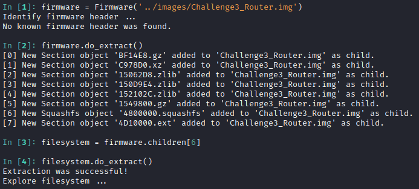
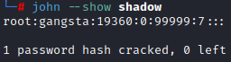
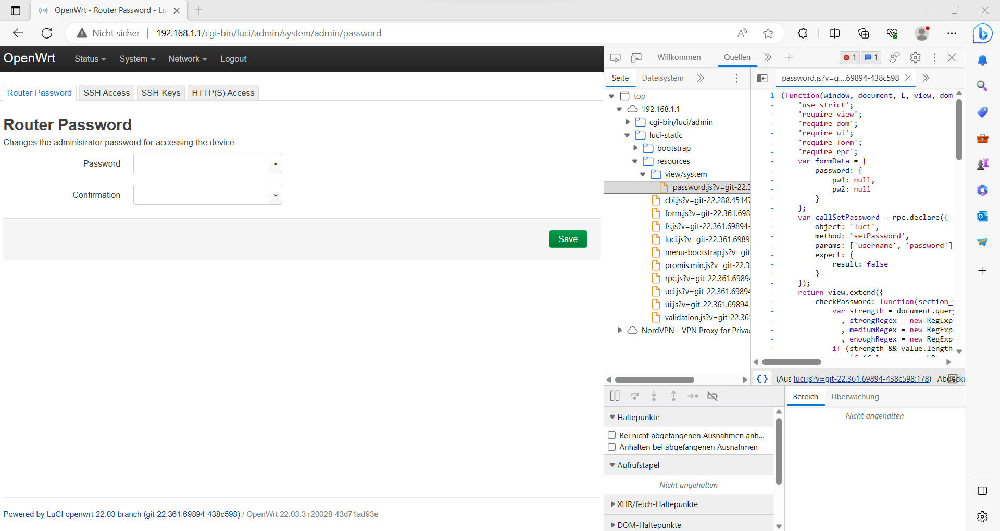
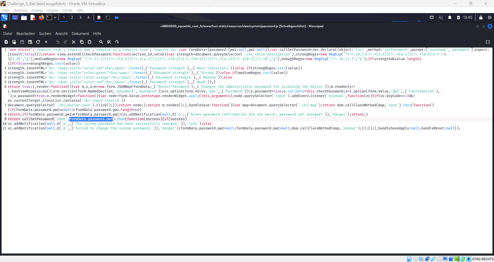
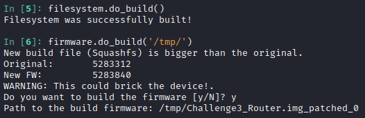
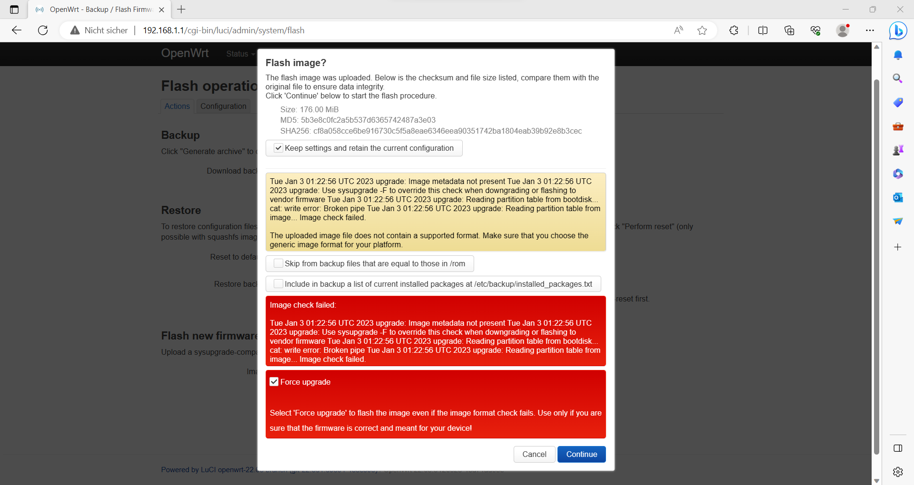

:warning: **Spoiler ahead!**

> __Warning__
Nachfolgend ist die Musterlösung der Challenge 1.
Nicht weiterlesen, wenn du diese Challenge noch absolvieren möchtest! Hinweise zum Lösen der Challenge findest du am Ende der Angabe.

<details>
<summary>Musterlösung anzeigen...</summary>
<br>

# Musterlösung

Der hier gezeigte Lösungsweg ist nicht der einzig mögliche. Es gibt auch andere Methoden diese Challenge zu lösen, jedoch ist dies der gedachte Ansatz, um am meisten aus der Challenge mitnehmen zu können.

Für die Musterlösung wird die auf dem USB-Stick beigelegte Kali-VM mit dem vorinstallierten Firmware IDIoT verwendet.

## Root Passwort finden und decrypten

Mit Hilfe des Firmware IDIoT wird die Firmware des Routers, wie in der Firmware IDIoT Anleitung beschrieben, mit folgenden Befehlen entpackt. Ein Screenshot der Firmware IDIoT Konsole zeigt das Entpacken des Filesystems.

```
cd /home/kali/firmware-idiot/idiot
sudo ./run_idiot.sh
firmware = Firmware('../images/Challenge3_Router.img')
firmware.do_extract()
filesystem = firmware.children[6]
filesystem.do_extract()
```



In der entpackten Firmware unter `/root/.idiot/.idiot_session_<date>` wird nun im extrahierten Filesystem (`tmp/_Challenge3_Router.img.extracted/4800000_squashfs_root_fs`) zur Datei `/etc/shadow` navigiert. In dieser befinden sich alle User und deren Passwörter, auch der folgende String, welcher den Passwort-Hash des root users beinhaltet.

```
root:$1$yC6Jtuds$djIsU.aDJtlFpCQonPlK00:19360:0:99999:7:::
```

Der Passwort Hash lässt sich mittels John the Ripper decrypten, da das Passwort in der Worldlist vorkommt. Nach Ausführen des Befehls `john --show shadow` erscheint das Passwort: `gangsta`.



## Firmware manipulieren und bauen

Nach dem Entschlüsseln des Passworts erfolgt die Anmeldung an der Weboberfläche des Routers (192.168.1.1) und die Navigation zum Reiter `System -> Administration -> Router Password`. Beim Betrachten des Seitenquelltexts lässt sich erkennen, dass das JavaScript `password.js` aufgerufen wird.



Im extrahierten Dateisystem wird nun nach dieser Datei gesucht und sie wird so modifiziert, dass das Passwort unverändert bleibt, selbst wenn ein Versuch zur Änderung über die Web-Oberfläche unternommen wird. Hierzu gibt es mehrere richtige Lösungen, eine der möglichen Herangehensweisen ist es, in der Funktion `callSetPassword` den Parameter `formData.password.pw1` durch den String `"gangsta"` zu ersetzen. Somit wird immer dieses Passwort festgelegt, egal welches Passwort der Benutzer in der Web-Oberfläche eingibt.



Nach dem Speichern der Datei muss nun die Firmware wieder zusammengebaut werden. Mit folgenden Befehlen wird zuerst das Filesystem gebaut und anschließend die Firmware. Die neue Firmware ist nun im Ordner `/tmp` zu finden und hat den Namen `Challenge3_Router.img_patched_0`.



```
filesystem.do_build()
firmware.do_build('/tmp/')
```

## Firmware einspielen und testen

Im Reiter `System -> Backup/Flash Firmware` kann am Ende der Seite über den Button `Flash image...` eine Firmware ausgewählt und installiert werden. Vor der Installation erscheint ein Warnhinweis, dass die neue Firmware nicht verifiziert werden kann. Dieser wird ignoriert und mit dem Installieren der Firmware begonnen.

Ist das Installieren beendet, kann die neue Firmware getestet werden. Dazu wird zuerst im Reiter `Administration -> Passwort` ein neues Passwort gesetzt und anschließend auf `Logout` geklickt. Bei einem erneuten Anmeldeversuch sollte die Anmeldung mit dem eben festgelegten Passwort fehlschlagen und weiterhin mit dem vorherigen Passwort (gangsta) erfolgreich sein.



</details>
